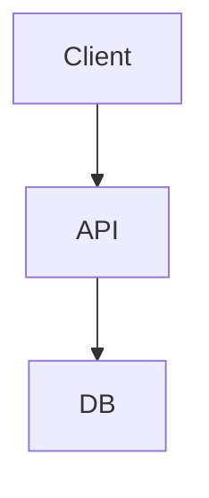

# Architecture: [Feature Name]
**PRD Reference**: [Link to PRD]
**Status**: [Draft/Review]

## 1. High-Level Design
*(Briefly describe the solution architecture. Use Mermaid if possible.)*


## 2. Data Schema
### [Table/Collection Name]
```sql
CREATE TABLE example (
  id UUID PRIMARY KEY,
  created_at TIMESTAMP DEFAULT NOW(),
  -- Add comments for complex logic
);
```

## 3. API & Communications
- **Endpoint**: `POST /api/v1/resource`
    - **Header**: `Authorization: Bearer <token>`
    - **Body**: `{ "field": "value" }`
    - **Response**: `201 Created`

## 4. Component Hierarchy (Frontend)
- `PageLayout`
    - `FeatureContainer`
        - `DataList` (Smart Component)
            - `ListItem` (Dumb Component)

## 5. Security & Validation
- **Authentication**: Usage of `authMiddleware`.
- **Validation**: Zod schema `InsertSchema` used on both client/server.
- **Permissions**: Only `ADMIN` role can access.

## 6. Testing Strategy
- **Unit**: Test utility functions in `utils/`.
- **Integration**: Test API endpoints with mock DB.
- **E2E**: Critical flows (e.g. Payment) via Playwright.

## 7. Implementation Plan
1. [ ] Database Schema Migration
2. [ ] Backend API Implementation
3. [ ] Frontend UI Components
4. [ ] Integration & Testing

